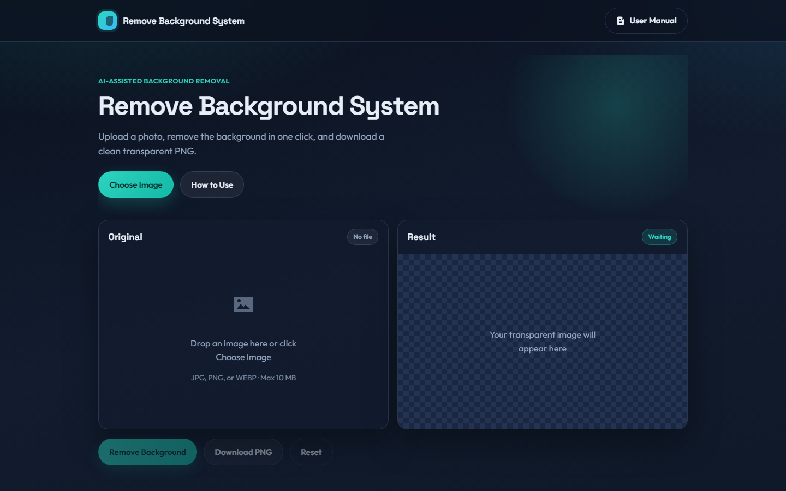
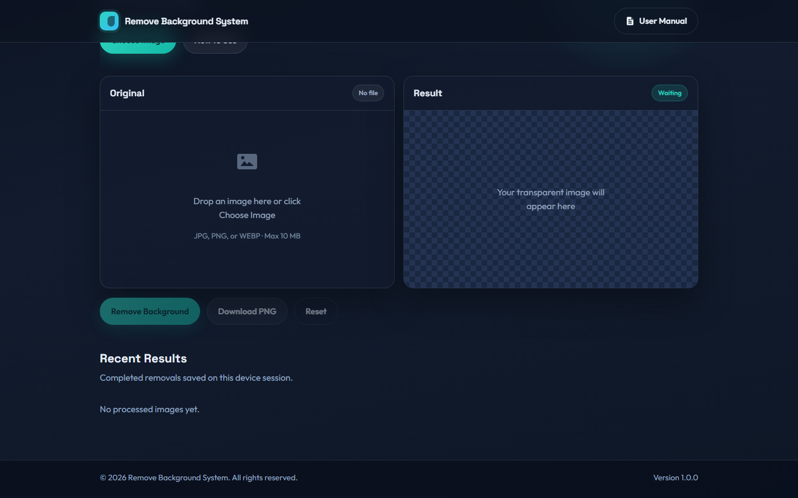
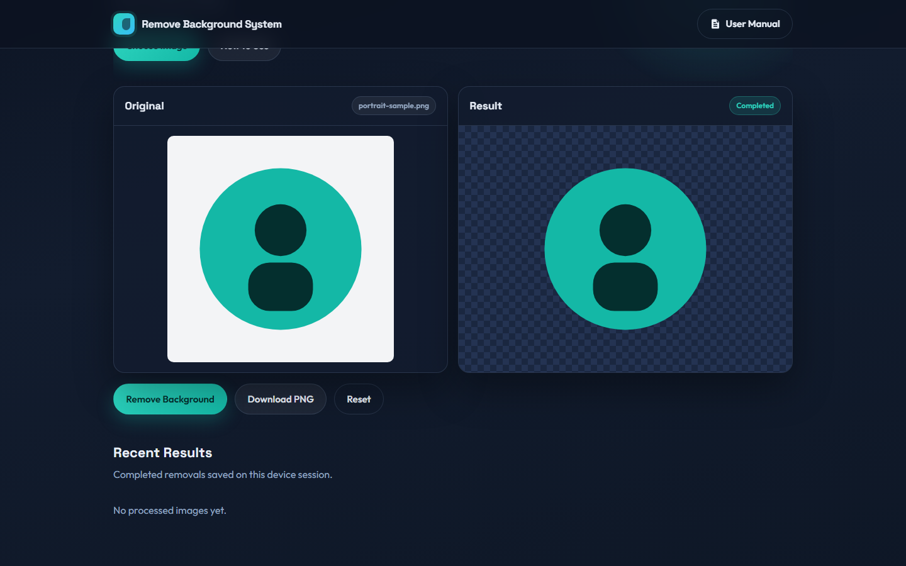
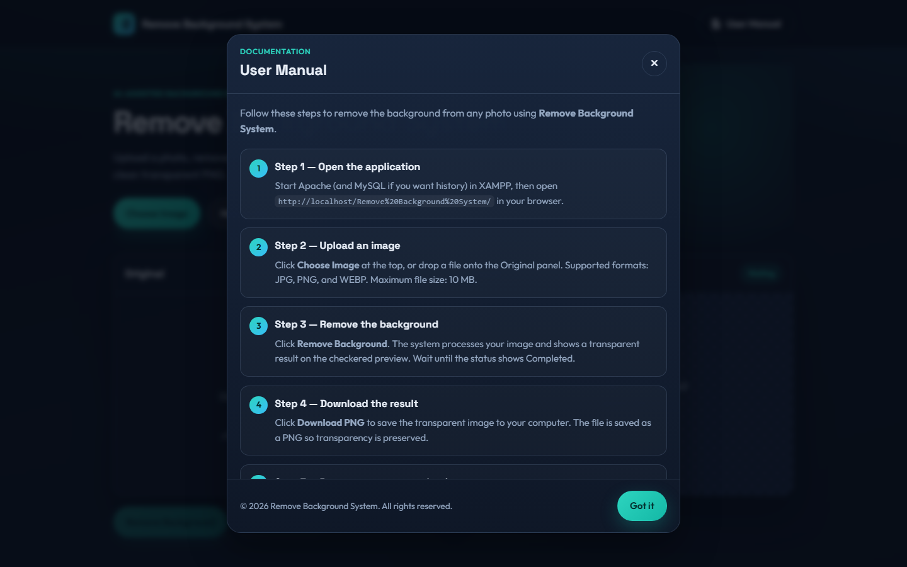
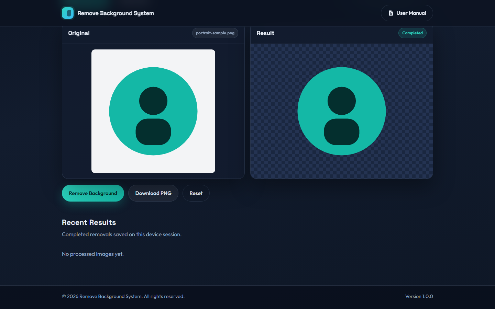

# 🪄 **Remove Background System**

A modern **Remove Background System** built with **PHP**, **MySQL**, **HTML**, **CSS**, and **JavaScript**.  
Upload a photo, remove the background in one click, and download a clean **transparent PNG**.

✨ Feel free to explore, contribute, and enhance the project! 🚀

---

## 🎬 **Project Demo Video**

📺 Watch the full system demo (upload, remove background, download PNG & user manual):

👉 **[Watch on Google Drive](https://drive.google.com/file/d/1f5ULPh5VJc0Ng0gP4xyC73PpFFzr0XqR/view?usp=sharing)**

---

## ✨ **Features**

- 📤 **Easy Upload** — click **Choose Image** or drag & drop a photo onto the Original panel  
- 🖼️ **Format Friendly** — supports **JPG**, **PNG**, and **WEBP** (max **10 MB**)  
- ✂️ **One-Click Removal** — AI-assisted background removal with a local fallback  
- 🏁 **Transparent PNG** — preview on a checkered canvas, then download a clean PNG  
- 🕘 **Recent Results** — optional MySQL history for completed images  
- 📘 **Built-in User Manual** — English step-by-step guide from the top navigation (one click)  
- ©️ **Copyright Footer** — ownership notice on the page and inside the manual  
- 🖥️ **Runs Locally** — XAMPP / Apache, no cloud account required  

---

## 🏗️ **Tech Stack**

| **Category** | **Technology** |
| --- | --- |
| 🖥️ **Frontend** | HTML5, CSS3, JavaScript (ES Modules) |
| 🔙 **Backend** | Native PHP 8+ (prepared statements) |
| 🗄️ **Database** | MySQL (`remove_bg_system`) — optional history |
| 🧠 **Removal Engine** | `@imgly/background-removal` + local edge fallback |
| 🎨 **UI Design** | Custom modern CSS (Outfit + Space Grotesk) |
| 🌐 **Server** | Apache (XAMPP) |

---

## 🖼️ **Project Screenshots**

<p align="center">
  
</p>

<table>
  <tr>
    <td width="50%" align="center">
      
    </td>
    <td width="50%" align="center">
      
    </td>
  </tr>
  <tr>
    <td width="50%" align="center">
      
    </td>
    <td width="50%" align="center">
      
    </td>
  </tr>
</table>

---

## 📋 **Requirements**

- 💻 XAMPP (Apache + PHP 8.0+) **or** a PHP hosting panel  
- 🌐 Modern browser (Chrome / Edge / Firefox)  
- ⚡ JavaScript enabled  

---

## 🚀 **Installation**

1. 📁 Place the project in your web root, for example:
   ```text
   C:\xampp\htdocs\Remove Background System
   ```
2. ▶️ Start **Apache** in the XAMPP Control Panel. Start **MySQL** only if you want Recent Results.
3. 🗄️ *(Optional)* Import `database/schema.sql` in phpMyAdmin.
4. 🌐 Open the app:
   ```text
   http://localhost/Remove%20Background%20System/
   ```
5. 📘 Click **User Manual** in the top bar for the full English guide.

> 💡 After updates, hard refresh with **Ctrl + F5**.

---

## 📁 **Folder Structure**

```text
Remove Background System/
├── api/                      # Upload, save, history APIs
├── assets/
│   ├── css/
│   └── js/
├── includes/                 # Config and database helper
├── database/
│   └── schema.sql
├── docs/
│   └── screenshots/          # README screenshots
├── uploads/                  # Original images
├── processed/                # Transparent PNG outputs
├── index.php                 # Main UI + User Manual modal
├── README.md
├── CONTRIBUTING.md
└── LICENSE
```

---

## 🤝 **Contributing**

Contributions are welcome! Please read [CONTRIBUTING.md](CONTRIBUTING.md) before opening a pull request.

💡 To contribute, check the guidelines and open a PR with a clear description of what you changed.

---

## 📝 **License**

This project is licensed under the [MIT Non-Commercial License](LICENSE).

---

⭐ If you find this project helpful, don't forget to **star** the repository! 🌟

Happy coding! 💻🎉
